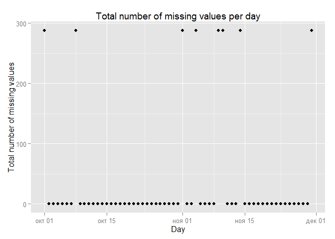

# Reproducible Research: Peer Assessment 1


## Loading and preprocessing the data

```r
# load library
library(dplyr)
library(ggplot2)

# unzip and load data
unzip('activity.zip')
df <- read.csv(file = "activity.csv",
               colClasses = c('integer', 'Date', 'integer'))
```


## What is mean total number of steps taken per day?

```r
# total number of steps taken per day
total_steps_per_day <- df %>%
    group_by(date) %>%
    summarise(total_steps = sum(steps, na.rm = TRUE))

# histogram of the total number of steps taken each day
ggplot(data = total_steps_per_day, aes(x = total_steps)) +
    geom_histogram(binwidth = 1000) +
    scale_x_continuous(limits = c(0, 22000), breaks = seq(from=0, to=22000, by=2000)) +
    scale_y_continuous(limits = c(0, 10), breaks = 0:10) +
    ggtitle('Total number of steps per day') +
    xlab('Total number of steps') +
    ylab('Days')
```

 

```r
# mean and median of the total number of steps taken per day
mean_total_steps <- round(mean(total_steps_per_day$total_steps))
median_total_steps <- median(total_steps_per_day$total_steps)
```

Mean of the total number of steps taken per day =
``9354``

Median of the total number of steps taken per day =
``10395``

## What is the average daily activity pattern?

```r
# average number of steps
average_steps_per_interval <- df %>%
    group_by(interval) %>%
    summarise(average_steps = mean(steps, na.rm = TRUE))

# time series plot
qplot(interval, average_steps, data = average_steps_per_interval, geom = 'line',
      main = 'Average number of steps taken, averaged across all days',
      xlab = '5-minute interval', ylab = 'Average number of steps')
```

 

```r
# index of the maximum number of steps in table
i <- which.max(average_steps_per_interval$average_steps)
# maximum number of steps
max_average_steps <- average_steps_per_interval$average_steps[i]
# name of 5-minute interval, which contains the maximum number of steps
interval_of_max_average_steps <- average_steps_per_interval$interval[i]
```

``835``-th
5-minute interval contains the maximum number of steps 
(``206.1698113``)

## Imputing missing values

```r
# total number of missing values in the dataset
total_na <- sum(is.na(df))
```
Total number of missing values in the dataset =
``2304``

Examine missing values:

```r
# total number of missing values in the dataset per day
total_na_per_day <- df %>%
    group_by(date) %>%
    summarise(total_na = sum(is.na(steps)))

# histogram of the total number of missing values per day
qplot(date, total_na, data = total_na_per_day, geom = 'point',
      main = 'Total number of missing values per day',
      xlab = 'Day', ylab = 'Total number of missing values')
```

 

The graph shows that there are 8 days for which all values are missing. So i will use the means for the 5-minute intervals.


```r
# merge dataset with average number of steps
df_filled <- merge(df, average_steps_per_interval, by = 'interval', all.x = T) %>%
    mutate(steps = as.numeric(steps))
 
# imputing missing values with average on 5-min interval
nas <- is.na(df_filled$steps)
df_filled$steps[nas] <- df_filled$average_steps[nas]
df_filled <- arrange(df_filled, date, interval)

# total number of steps taken per day
total_steps_per_day <- df_filled %>%
    group_by(date) %>%
    summarise(total_steps = round(sum(steps)))

# histogram of the total number of steps taken each day
ggplot(data = total_steps_per_day, aes(x = total_steps)) +
    geom_histogram(binwidth = 1000) +
    scale_x_continuous(limits = c(0, 22000), breaks = seq(from=0, to=22000, by=2000)) +
    scale_y_continuous(limits = c(0, 18), breaks = seq(from=0, to=18, by=2)) +
    ggtitle('Total number of steps per day') +
    xlab('Total number of steps') +
    ylab('Days')
```

 

```r
# mean and median of the total number of steps taken per day
mean_total_steps <- as.integer(mean(total_steps_per_day$total_steps))
median_total_steps <- as.integer(median(total_steps_per_day$total_steps))
```

Mean of the total number of steps taken per day =
``10766``

Median of the total number of steps taken per day =
``10766``

## Are there differences in activity patterns between weekdays and weekends?

```r
# create a new variable wday (0–6 day of the week, starting on Sunday)
df_filled$wday <- as.POSIXlt(df_filled$date)$wday

# convert variable wday to a factor variable
weekend <- df_filled$wday == 0 | df_filled$wday == 6
df_filled$wday[weekend] <- 'weekend'
df_filled$wday[!weekend] <- 'weekday'
df_filled$wday <- as.factor(df_filled$wday)

# average number of steps taken, averaged across all weekday days or weekend days
average_steps_per_interval_2 <- df_filled %>%
    group_by(wday, interval) %>%
    summarise(average_steps = mean(steps))

# panel plot containing a time series plot
ggplot(data = average_steps_per_interval_2, aes(x = interval, y = average_steps)) +
    geom_line() +
    facet_grid(wday~.) +
    ggtitle('Average number of steps taken, averaged across all days') +
    xlab('5-minute interval') + ylab('Average number of steps')
```

 
